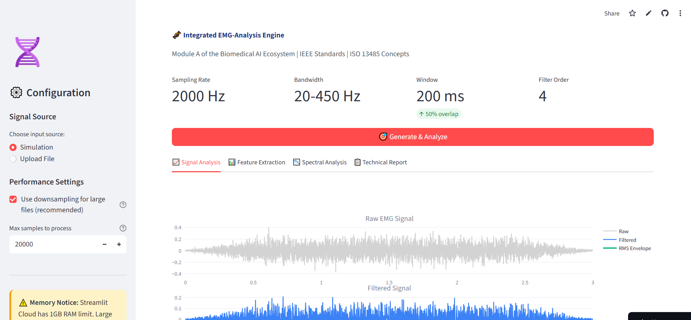
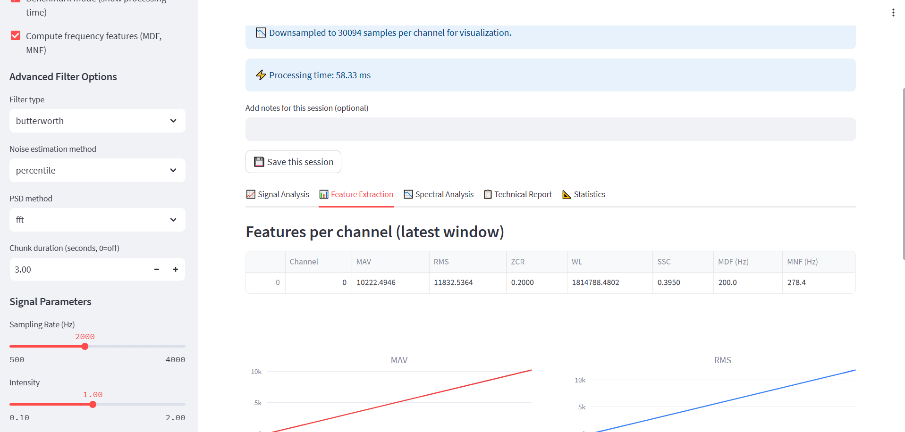
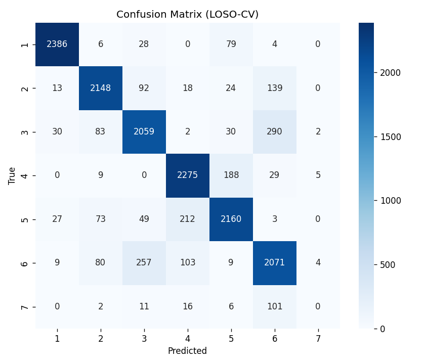

# EMG Analysis Engine — Module A

### An open-source, IEEE/ISEK-compliant platform for reproducible EMG signal processing, feature extraction, and benchmark validation

[](https://doi.org/10.5281/zenodo.18965272)
[](https://python.org)
[](LICENSE)
[](https://emg-analysis-engine-qussai-adlbi.streamlit.app/)

**Author:** Qussai Adlbi  
**Institutions:** Al-Andalus University for Medical Sciences · Pázmány Péter Catholic University  
**Contact:** adlbiqussai@gmail.com · [LinkedIn](https://www.linkedin.com/in/qussai-adlbi-99aa05385) · [GitHub](https://github.com/Qussai-BME/emg-analysis-engine)

---

## The Problem This Solves

Electromyography analysis in 2026 suffers from two simultaneous failures.

Clinical systems cost upward of $15,000, operate as sealed black boxes, and offer zero access to the algorithm underneath. Open-source alternatives are lab-specific scripts: undocumented filter parameters, preprocessing decisions chosen by someone who left three years ago, results that cannot be reproduced six months later.

The consequence is structural: the path from EMG signal to clinical insight is longer, more expensive, and less trustworthy than it needs to be. Published accuracy figures frequently exceed 95% in studies where random train-test splits permit inter-session leakage — a systematic inflation that collapses under proper Leave-One-Subject-Out evaluation.

This project is the infrastructure answer to that problem.

---

## 🎯 Key Results (XGBoost, LOSO)

| Dataset | Task Type | Accuracy |
|---------|-----------|----------|
| **UCI Gesture** | Hand Gesture (7 classes) | **96.90%** ± 2.66% |
| **NinaPro DB7** | Dexterous (40 classes, incl. amputees) | **87.93%** ± 3.10%* |
| **UCI Physical Action** | Gross Motor (2 classes) | **98.66%** ± 0.53% |

*\*Preliminary 5‑subject cohort; full 40‑subject validation ongoing.*

---

## 📊 Validated Performance Across Three Datasets

| Dataset | Task Type | #Subj | #Ch | Classes | Optimal `remove_class_zero` | Accuracy |
|---------|-----------|-------|-----|---------|-----------------------------|----------|
| **UCI Gesture** | Hand Gesture | 36 | 8 | 7 + rest | `true` | 96.90% ± 2.66% |
| **NinaPro DB7** | Dexterous Hand | 5* | 12 | 40 + rest | `false` | 87.93% ± 3.10% |
| **UCI Physical Action** | Gross Motor | 4 | 8 | 2 (normal/aggressive) | `false` | 98.66% ± 0.53% |

*\*Preliminary cohort includes 3 intact subjects and 2 transradial amputees.*

**Note on UCI Gesture ablation study:** The primary 7-gesture result is 96.90%. An ablation study using the harder 8‑class protocol (including rest) yielded 87.16% for the recommended configuration — this distinction is explained in the paper.

**Typical baseline for 40-class LOSO (no domain adaptation): 45–65%.** This engine exceeds that range by ~25 percentage points on a mixed intact/amputee cohort.

---

## 🔬 Ablation Study — What Actually Drives Accuracy

Six controlled experiments under identical conditions (36 subjects, XGBoost, LOSO, 8-class protocol):

| Feature Configuration | LOSO Accuracy | Δ vs. Baseline | Time |
|----------------------|---------------|----------------|------|
| Time-domain only | 86.13% ± 14.07% | −0.79% | ~5 min |
| Full baseline | 86.92% ± 14.65% | — | ~25 min |
| Baseline − wavelets | 86.99% ± 14.50% | +0.07% | ~15 min |
| Baseline − AR(6) | 86.98% ± 14.53% | +0.06% | ~20 min |
| Baseline − inter-channel corr. | 86.19% ± 14.34% | −0.73% | ~25 min |
| **★ −Wavelets −AR (recommended)** | **87.16% ± 14.45%** | **+0.24%** | **~8 min** |

**Key finding:** Removing wavelets and AR simultaneously improves accuracy by +0.24% while cutting processing time by ~70%. Inter-channel Pearson correlations are the only advanced feature group with meaningful positive contribution (−0.73% when removed) — because spatial muscle co-activation patterns are irreducibly multi-channel.

---

## 🧩 What's New (v2.0)

- **Third dataset added**: *UCI EMG Physical Action Data Set* (binary classification of normal vs. aggressive full‑body movements).
- **Dataset‑specific configuration**: Processing parameters (e.g., `remove_class_zero`) can now be defined per dataset in `config.yaml`, allowing the pipeline to automatically apply the optimal settings for each database.
- **Improved robustness**: Recursive file discovery, flexible subject grouping, and fallback label extraction for heterogeneous data structures.
- **Performance optimizations**: Parallel feature extraction, `hist` tree method for XGBoost, and chunk‑based windowing to avoid memory errors.

---

## 📸 Screenshots

### Streamlit Dashboard
[](docs/images/Screenshot1.png)
*Interactive signal visualisation, channel selection, and real‑time analysis.*

### Feature Extraction & Spectral Analysis
[](docs/images/Screenshot2.png)
*Time‑domain feature extraction and frequency‑domain analysis with clinical sub‑bands highlighted.*

### Confusion Matrices (LOSO)

| UCI Gesture | NinaPro DB7 | UCI Physical Action |
|-------------|-------------|---------------------|
| [](docs/images/UCI_Gesture_cm.png) | [](docs/images/Ninapro_DB7_cm.png) | [](docs/images/UCI_Physical_Action_cm.png) |

---

## 🏗️ Architecture — Full Repository Tree

```
emg-analysis-engine/
│
├── src/
│   ├── core_engine.py        # IEEE/ISEK filtering + feature extraction (no UI dependencies)
│   ├── app.py                # Streamlit dashboard (entry point)
│   ├── emg_stats.py          # PCA, fatigue index, correlation matrix
│   ├── database.py           # SQLite session logging
│   ├── pdf_report.py         # PDF report generator (detailed + simplified)
│   └── api.py                # Optional FastAPI REST endpoint
│
├── validation/
│   ├── config.yaml           # Full pipeline config (LOSO / Within-Subject toggle)
│   ├── validate_engine.py    # CLI entry point with parallel processing
│   ├── process_engine.py     # Feature extraction: Hjorth, TKEO, inter-ch. corr., chunked windowing
│   ├── data_loaders.py       # UCI / NinaPro DB7 / CEMHSEY / UCI Physical Action loaders
│   ├── metrics.py            # LOSO-CV + Within-Subject (RF, XGBoost, LDA)
│   ├── report_generator.py   # Markdown / HTML / JSON reports
│   └── checkpoint.py         # Resume-from-checkpoint utility
│
├── data/
│   ├── sample_emg.csv        # 3-second synthetic EMG for instant testing
│   └── emg+data+for+gestures/  # UCI Gesture dataset (36 subjects)
│
├── docs/images/              # Screenshots, confusion matrices
├── validation_reports/       # Output reports (JSON, MD, HTML, CM plots) — generated at runtime
├── requirements.txt
├── experiment_notes.md       # Lab notebook: documented surprises and design decisions
└── README.md
```

**The core architectural decision:** `core_engine.py` is fully decoupled from `app.py`. This is not cosmetic — it was the mechanism that exposed an otherwise undetectable bug where Streamlit session state was silently altering SNR quality gate results when called programmatically vs. through the interface. Independent unit testing of the processing layer requires this separation.

---

## ⚙️ What It Does

### Input
CSV, TXT, NPY, or EDF files. Multi-channel support with automatic time-column removal, interactive channel selection, and live signal preview. File size validation on upload prevents silent cloud memory failures.

### Preprocessing
- **Bandpass filter:** Zero-phase 4th-order Butterworth, 20–450 Hz (IEEE/ISEK clinical standard). Zero-phase implementation via `filtfilt` preserves temporal accuracy for ZCR and SSC features.
- **Notch filter:** Adaptive 50 Hz IIR notch (Q = 30). Applied **only if** PSD analysis detects a powerline peak — battery-powered recordings without interference are not distorted. This policy change came from observing artifact introduction on clean signals.
- **Quality gate:** Adaptive SNR estimation (percentile, median, or manual noise floor). Signals below 20 dB are flagged before any feature extraction runs. All quality decisions are logged in JSON output.

### Feature Extraction (264 dimensions — recommended config)

| Group | Features | Count |
|-------|----------|-------|
| Time-domain | IEMG, MAV, logMAV, MAVS, SSI, RMS, logRMS, V-order, Log-detector, WL, ZCR, SSC, logVAR, Skewness, Kurtosis, TKEO | 16 per channel |
| Hjorth parameters | Activity, Mobility, Complexity | 3 per channel |
| Frequency-domain | MNF, MDF, Peak freq., Spectral entropy, Band powers (3 sub-bands) | 7 per channel |
| Inter-channel correlations | All pairwise Pearson r (28 pairs for 8ch, 66 for 12ch) | N×(N−1)/2 |

Wavelets and AR(6) are **disabled by default** — ablation confirms they reduce accuracy while tripling compute time.

### Memory-Efficient Processing
NinaPro DB7 generates ~86,000 windows per subject across 12 channels. Naive tensor construction requests 784 MiB. The chunked windowing algorithm (`windowing_chunk_size = 1024`) reduces peak RAM to ~50 MiB, enabling execution on standard workstations without data loss.

### Validation Suite
- **LOSO protocol:** SelectKBest (k = 250) and Z-score normalization fitted on training folds only, applied to held-out subject without refitting. No data leakage.
- **Within-Subject mode:** For personalized prosthetic calibration simulation.
- **Classifiers:** XGBoost (primary), Random Forest, LDA, SVM‑RBF, Ensemble.
- **Reports:** Automatic Markdown / HTML / JSON with full parameter traceability.

### Output
Streamlit dashboard + standardized versioned JSON schema. Five analysis tabs, statistical tools (descriptive stats, correlation matrix, PCA, fatigue index), PDF reports, SQLite session logging.

---

## 🧠 Hard Lessons (Encoded in the Architecture)

These are not footnotes. They are the engineering decisions that make this platform reliable on real data.

**1. The notch filter can be wrong.** Applying 50 Hz notch universally distorts battery-powered recordings. The engine now runs PSD analysis first. Notch fires only when warranted.

**2. Window size is a clinical decision.** 100 ms reacts fast but produces jittery features. 400 ms stabilizes estimates but loses temporal resolution. The engine exposes this trade-off explicitly rather than hiding it behind a default.

**3. Data leakage makes results meaningless.** Early tests showed 95%+ accuracy under random splits. LOSO reduced this substantially. Random splits allow inter-session memorization, not generalization. Subject-wise separation is now a non-negotiable constraint.

**4. Cloud deployment is an engineering constraint.** Streamlit Community Cloud provides 1 GB RAM. A 500k-sample 8-channel file with filter copies, feature arrays, and Plotly figures exceeds this. The fix: file size checks, smart downsampling for visualization, graceful degradation when memory headroom is low.

**5. Large datasets require chunked thinking.** The naive NinaPro DB7 implementation requested 784 MiB for a single-subject window tensor. MemoryError on a standard laptop. Solution: chunked processing. Peak RAM → 50 MiB. Scalable engineering is not about brute force.

**6. Dataset‑specific parameters are not global.** Applying `remove_class_zero: true` to all datasets cost 3.94% accuracy on NinaPro DB7. The pipeline now supports per‑dataset overrides — a lesson in avoiding one‑size‑fits‑all defaults.

---

## 🚀 Quick Start

### 1. Installation
```bash
git clone https://github.com/Qussai-BME/emg-analysis-engine.git
cd emg-analysis-engine
python -m venv venv
source venv/bin/activate      # Linux/Mac
venv\Scripts\activate         # Windows
pip install -r requirements.txt
```

### 2. Configure `validation/config.yaml`
Set paths and dataset‑specific overrides:

```yaml
datasets:
  uci:
    remove_class_zero: true
    path: 'C:/data/UCI_Gesture'
    sampling_rate: 1000
  ninapro_db7:
    remove_class_zero: false
    path: 'E:/NinaProDB7'
    sampling_rate: 2000
  uci_physical:
    remove_class_zero: false
    path: 'E:/UCI_Physical_Action'
    sampling_rate: 1000
```

### 3. Run Validation
```bash
# Process all three datasets
python validation/validate_engine.py --datasets uci ninapro_db7 uci_physical

# Quick test (first subject only)
python validation/validate_engine.py --datasets uci ninapro_db7 uci_physical --quick

# Launch Streamlit app
streamlit run src/app.py
```

Reports are saved in `./validation_reports/`.

---

## 🛠️ Troubleshooting

| Issue | Solution |
|-------|----------|
| `MemoryError` during windowing | Reduce `windowing_chunk_size` in `config.yaml` (e.g., to 512). |
| "No subjects to process" | Check dataset path and folder structure. Use diagnostic function for UCI Physical Action. |
| `StopIteration` in parallel mode | Ensure loader yields a dictionary with `subject_id`, `emg`, `labels`. |
| XGBoost predictions are 2D | The pipeline automatically converts probability outputs to class labels. |

---

## 📖 Limitations — What This Is Not

| ✅ This platform is | ❌ This platform is not |
|---------------------|------------------------|
| A research-grade signal processing and classification tool | An FDA-approved or CE-marked medical device |
| An open, reproducible EMG pipeline with LOSO-validated performance | Clinically validated on patient populations |
| Developed with ISO 13485 / IEC 62304 concepts (traceability, config management) | ISO 13485 or IEC 62304 certified |
| A foundation for regulatory-pathway development | Suitable for diagnostic or treatment decisions |

Current validation uses open-source research datasets recorded under controlled laboratory conditions. Real-world clinical noise, electrode placement variability, and skin impedance differences are not fully characterized. Any clinical application requires IRB-approved trials, regulatory review, and large-scale validation.

**Transparency about what a system cannot do is not a weakness. In medical engineering, it is the only ethical baseline.**

---

## 🗺️ Roadmap

| Module | Status | Description |
|--------|--------|-------------|
| **Module A** | ✅ Complete | IEEE/ISEK preprocessing · 264-feature extraction · LOSO validation suite · Streamlit dashboard |
| **Module A2 — MyoControl Lite** | 🔄 Next | 6-gesture classifier on Ninapro DB1 · LOSO SVM · integrated as Streamlit tab |
| **Module B — Gait Analysis** | 📋 Planned | EMG + IMU fusion · complementary filter · stance/swing detection |
| **Module C — Robot Interface** | 📋 Planned | EMG → UR5 velocity control in PyBullet · EMA smoothing |
| **Module D — Adaptive Control** | 📋 Planned | Tremor bandstop (8–12 Hz) · real-time fatigue compensation |
| **Data-Fusion Hub** | 📋 Long-term | Cloud-scalable multi-modal platform · versioned schema · longitudinal studies |

---

## 📄 Citation

```bibtex
@software{adlbi2026emg,
  author    = {Qussai Adlbi},
  title     = {{EMG Analysis Engine — Module A: An open-source, IEEE/ISEK-compliant
               platform for reproducible EMG signal processing and feature extraction}},
  month     = mar,
  year      = 2026,
  publisher = {Zenodo},
  version   = {v2.0.0},
  doi       = {10.5281/zenodo.18965272},
  url       = {https://doi.org/10.5281/zenodo.18965272}
}
```

---

## 🤝 Collaboration

Actively seeking:
- Research collaborators in biomedical engineering, neurology, and rehabilitation medicine
- Academic partners for clinical dataset access and IRB-approved validation studies
- Grant opportunities: NIH NIBIB · Wellcome Trust · EU Horizon Europe
- Institutional pilots with rehabilitation centres or prosthetics labs

📧 adlbiqussai@gmail.com | [LinkedIn](https://www.linkedin.com/in/qussai-adlbi-99aa05385) | [GitHub](https://github.com/Qussai-BME)

---

## 📚 References

1. De Luca, C.J. et al. (2010). Filtering the surface EMG signal. *J. Biomechanics*, 43(8), 1573–1579.
2. Phinyomark, A. et al. (2012). Feature reduction and selection for EMG signal classification. *Expert Systems with Applications*, 39(8), 7420–7431.
3. Oskoei, M.A. & Hu, H. (2007). Myoelectric control systems — a survey. *Biomedical Signal Processing and Control*, 2(4), 275–294.
4. Atzori, M. et al. (2014). Electromyography data for non-invasive naturally-controlled robotic hand prostheses. *Scientific Data*, 1, 140053.
5. Hermens, H.J. et al. (2000). Development of recommendations for SEMG sensors and sensor placement. *J. Electromyography and Kinesiology*, 10(5), 361–374.
6. Merletti, R. & Di Torino, P. (1999). Standards for reporting EMG data. *J. Electromyography and Kinesiology*, 9(1), III–IV.
7. IEEE/ISEK standards for surface EMG processing.
8. ISO 13485:2016 — Medical devices quality management systems.
9. IEC 62304:2006 — Medical device software lifecycle processes.

---

## 📜 License

MIT — open for research use.  
Commercial deployment and clinical use require separate agreements and regulatory compliance.

---

*Built at the intersection of signal processing, clinical need, and the stubborn belief that good science should be accessible.*  
*This is not the final version. It is the right foundation.*