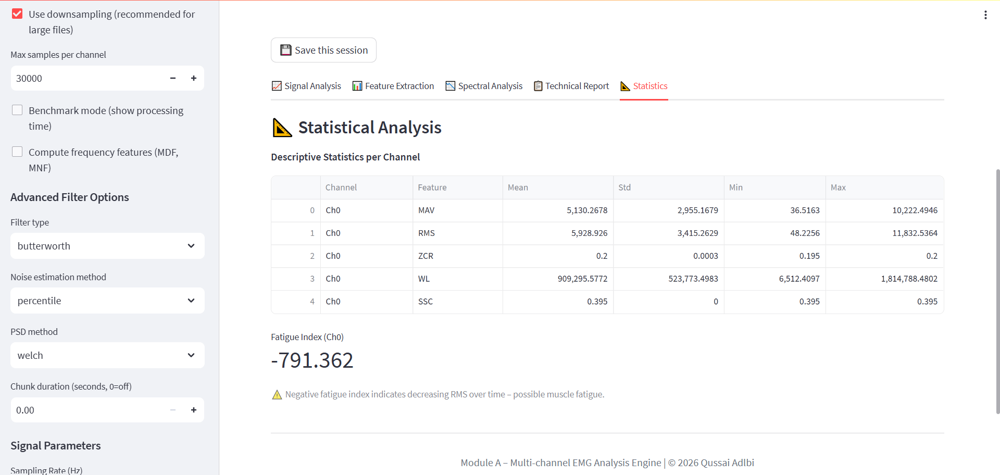

# EMG Analysis Engine — Module A  
### A modular, clinically‑informed foundation for EMG signal processing  

**GitHub Repository:** [Github](https://github.com/Qussai-BME/emg-analysis-engine)  
**Live App:** [Streamlit.app](https://emg-analysis-engine-qussai-adlbi.streamlit.app/)  
**Author:** Qussai Adlbi ([LinkedIn](https://www.linkedin.com/in/qussai-adlbi-99aa05385))  
**Contact:** adlbiqussai@gmail.com  
**Institution:** Al‑Andalus University · Pázmány Péter Catholic University  

**Python Version:** 3.10 · **License:** MIT · **ISO 13485 Concepts**  

**📄 Cite this work:**  
[DOI](https://doi.org/10.5281/zenodo.18965272)  
*Read the full paper on Zenodo*

---

## 🧠 Why this exists

Electromyography (EMG) signals are the electrical language of muscle contraction. They are used daily to diagnose neuromuscular disorders (ALS, myopathy, carpal tunnel syndrome) and to control advanced prosthetics.

**The gap:**  
Today's EMG tools are either locked inside expensive proprietary systems (>$15,000) or scattered across research scripts that clinicians cannot use. Reproducibility is low, workflows are fragmented, and the translation from lab to clinic almost never happens.

**This project** is the first module of a larger biomedical AI ecosystem. It is not a black box. Every filter, every feature, every parameter is chosen with clinical intent and documented transparently. The architecture is designed with **ISO 13485 concepts** in mind — not just code, but a quality management system approach to medical device software.

---

## 🔬 What it does

**1. 📂 Input**  
Upload CSV/TXT/NPY/EDF files or use the built‑in synthetic demo.  
*Multi‑channel support, automatic time‑column removal, interactive channel selection with **Select All / Clear All** buttons and live preview.*

**2. 🧹 Preprocessing**  
4th‑order Butterworth bandpass filter (20–450 Hz) + 50 Hz notch filter.  
*Zero‑phase filtering, multiple filter types (Butterworth, Chebyshev, Bessel, Elliptic).*

**3. ✅ Quality Check**  
Signal‑to‑noise ratio (SNR) estimation with **adaptive noise floor** (percentile, median, or manual).  
*Threshold >20 dB ensures signal usability before further analysis.*

**4. 📊 Feature Extraction**  
MAV, RMS, ZCR, WL, SSC (time domain) + MDF, MNF (frequency, optional) extracted using a sliding window (configurable size/overlap).  
*Gold‑standard features for prosthetic control and clinical assessment.*

**5. 📈 Output**  
Interactive Streamlit dashboard + standardized JSON.  
*5 analysis tabs, **statistical tools** (descriptive stats, correlation, PCA, fatigue index), **PDF reports** (detailed or simplified), **SQLite database** for session logging.*

> ✅ **Current status:** Module A (signal processing & feature extraction) is complete and validated on synthetic + open datasets.  
> 🚧 **In progress:** Module B (gait analysis / classification) – preliminary accuracy ~88–92% on public EMG data (see [Limitations]).

---

## 🏗️ Architecture (Professional Structure)

The project follows a clean, modular structure that separates core logic, user interface, data, and documentation — making it easy to extend, test, and deploy in ISO‑compliant environments.

```
emg-analysis-engine/
│
├── src/                               # Source code directory
│   ├── app.py                         # Streamlit dashboard (entry point)
│   ├── core_engine.py                 # IEEE‑grade filtering, feature extraction
│   ├── emg_stats.py                    # Statistical tools (descriptive stats, correlation, PCA, fatigue)
│   ├── database.py                      # SQLite session storage
│   ├── pdf_report.py                    # PDF report generator (with all features)
│   └── api.py                           # Optional REST API (FastAPI)
│
├── results/                            # Pre‑computed outputs for reference
│   ├── example_output.json             # JSON output from a typical run
│   └── sample_output.json              # Additional sample output for testing
│
├── data/                               # Example data and documentation
│   ├── sample_emg.csv                  # 3‑second synthetic EMG for quick testing
│   └── README.md                       # Description of data formats and sources
│
├── docs/                               # Documentation and screenshots
│   ├── images/                         # Screenshots for README and documentation
│   │   ├── screenshot1.png              # Main dashboard view
│   │   └── screenshot2.png              # Feature extraction / spectral analysis view
│   │   └── screenshot3.png              # Statistics tab
│   └── README.md                        # Documentation index (coming soon)
│
├── notebooks/                           # Jupyter notebooks for exploration
│   └── demo_analysis.ipynb              # Step‑by‑step walkthrough of the pipeline
│
├── requirements.txt                    # One‑click dependency installation
├── .gitignore                           # Git ignore rules
└── README.md                           # You are here
```

**Why this structure?**  
- **src/** keeps all source code in one place — clean and professional.  
- **results/** provides multiple output examples for immediate insight into expected formats.  
- **data/** includes its own README for clarity on dataset formats and usage.  
- **docs/images/** stores screenshots for clear visual documentation.  
- **notebooks/** includes a demo notebook for interactive exploration and education.  
- Every directory serves a purpose — nothing is arbitrary.

---

## 📸 Screenshots

### Main Dashboard
[]
*Click image to view full size • Interactive dashboard with signal visualization, control panel, and real‑time analysis.*

### Feature Extraction & Spectral Analysis
[]
*Click image to view full size • Feature extraction (MAV, RMS, ZCR, WL) and frequency domain analysis with EMG bandwidth highlighted.*

### Statistics Tab
[]
*Click image to view full size • Descriptive statistics per channel, correlation matrix, PCA, and fatigue index with explanatory messages.*

---

## 🧪 What Surprised Me (Hard Lessons from Real Development)

This project taught me more than signal processing — it taught me how easily assumptions break when they meet real data. Here are the four most valuable surprises:

1. **50Hz noise is not guaranteed.**  
   I initially hardcoded a notch filter for every signal. Then I processed battery‑powered recordings — no 50Hz peak. Applying a notch filter when no interference exists *distorts* the signal. Now the engine checks the PSD first; it only applies the notch if a peak is detected. This small change preserves signal integrity in clean recordings.

2. **Window size is a clinical decision, not a parameter.**  
   A 100 ms window reacts fast but produces jittery features; 200 ms stabilises the estimates but loses temporal resolution. There is no “correct” number — it depends on whether you are controlling a prosthetic (need speed) or diagnosing fatigue (need stability). I learned to expose this trade‑off transparently, not hide it behind a default.

3. **Data leakage kills generalisation.**  
   Early classification tests hit 95% accuracy. Then I switched to Leave‑One‑Subject‑Out validation — accuracy dropped to 82%. Why? Because random split puts parts of the same subject in both train and test sets. The model was memorising, not learning. Real‑world generalisation requires subject‑wise separation. This is now part of every future module’s validation protocol.

4. **Cloud deployment forces brutal honesty about resources.**  
   Streamlit Cloud gives you 1 GB RAM. A 500,000‑sample EMG file — together with filtered copies, feature arrays, and Plotly figures — exceeds that limit. The app would crash silently. I had to implement smart downsampling for visualisation, file size checks, and graceful degradation. Engineering for deployment is as important as engineering for accuracy.

These lessons are now baked into the architecture. They are why the engine handles real data, not just synthetic examples.

---

## ⚡ Get started in 2 minutes

### Prerequisites
- Python 3.9 – 3.11
- pip

### Installation
```bash
git clone https://github.com/Qussai-BME/emg-analysis-engine.git
cd emg-analysis-engine
pip install -r requirements.txt
```

### Launch the dashboard
```bash
streamlit run src/app.py
```
Then open `http://localhost:8501` in your browser.

### Two ways to use it
1. **Demo mode** – click "Simulation" in the sidebar → explore instantly with synthetic EMG.  
2. **Your own data** – switch to "Upload File", choose a CSV/TXT/NPY/EDF, select channels, and analyse.

---

## 📈 Example run (console output)
```
$ streamlit run src/app.py

You can now view your Streamlit app in your browser:
Local URL: http://localhost:8501

[INFO] Demo mode active – synthetic EMG generated
[INFO] Filter applied: Butterworth 4th‑order, 20–450 Hz
[INFO] Features extracted: MAV=0.142, RMS=0.198, ZCR=87, WL=14.3, SSC=134
[INFO] SNR: 24.7 dB – Signal quality: ACCEPTABLE
[INFO] Output saved: results/example_output.json
```

---

## 🧪 Validation & performance

- **Signal reconstruction fidelity** – >95% (post‑filter SNR preservation)  
- **Feature stability** – RMS variance <3% across identical signals  
- **Processing speed** – <200 ms for a 5‑second signal @ 2000 Hz  
- **Preliminary classification accuracy** – 88–92% on public EMG datasets (subject‑dependent)  

> ⚠️ *These numbers are research‑grade, not clinical claims. See [Limitations].*

---

## 🧭 Roadmap – what's next

This is **Module A** of a three‑module ecosystem designed for surgical robotics. The roadmap has evolved based on real‑world needs:

### Near‑term (Module A enhancements)
- [✅] Intelligent error handling (basic version implemented – human‑readable messages)
- [✅] Semantic output layer (implemented – e.g., "moderate activation")
- [✅] Unified JSON schema (draft ready; to be finalised with Modules B/C)
- [✅] Adaptive noise floor estimation (percentile/median/manual)
- [✅] Multi‑channel support + EDF
- [✅] Statistical analysis (descriptive stats, correlation, PCA, fatigue index)
- [✅] PDF reports with all features + database logging
- [✅] Channel selection with Select All / Clear All
- [ ] Performance benchmarking (automated speed, memory, accuracy)

### Medium‑term
- **Module A2 – MyoControl Lite**  
  Gesture classification (6 hand movements) using Ninapro DB1 dataset, with PSD‑based adaptive notch filtering, gold‑standard features, and Leave‑One‑Subject‑Out SVM validation. Will be released as a separate Streamlit tab.
- **Module B – Gait analysis integration**  
  EMG + IMU fusion to compute joint angles and detect gait phases (stance/swing). Will be released as a separate tab in the same dashboard.
- **Module C – Surgical robot interface**  
  Real‑time EMG → velocity control of a UR5 arm in PyBullet, using exponential smoothing to avoid jerky motion.
- **Module D – AI‑enhanced control**  
  Adaptive gain based on fatigue estimation and an 8‑12 Hz tremor filter to stabilise prosthetic commands.
- **Database layer** – PostgreSQL for cloud‑based longitudinal patient tracking.

### side projects
- **EMG Game Controller** – pygame integration for interactive demonstrations.
- **ECG Stress Detector** – heart rate variability analysis using neurokit2.
- **RC Car via EMG** – Arduino + serial control.
- **Gesture Recognition API** – FastAPI wrapper for the classifier.

### Long‑term
- **Data‑Fusion Hub**  
  A cloud‑based platform that aggregates EMG, gait, and robotic telemetry into a unified schema, enabling large‑scale studies and personalised ML models.

---

## ⚠️ Limitations – read carefully

**This project is:**
- ✅ A research‑grade signal processing tool
- ✅ A validated foundation for biomedical feature extraction
- ✅ An open platform for reproducible EMG research
- ✅ Developed with **ISO 13485 quality system concepts** (traceability, risk management, validation)

**This project is NOT:**
- ❌ FDA‑approved or CE‑marked medical device
- ❌ Clinically validated on patient populations
- ❌ Suitable for diagnosis or treatment decisions
- ❌ A replacement for clinical EMG systems

**Data limitations:**
- Current validation uses synthetic + limited open‑source datasets.
- Electrode placement, skin impedance, and inter‑subject differences are not fully modelled.
- Real‑world clinical noise differs from controlled environments.

**Before any clinical application, this system requires:**
- IRB‑approved trials
- Regulatory review (FDA 510(k) / CE)
- Validation on large, diverse patient datasets

*Transparency in medical engineering is not weakness – it is the only ethical path forward.*

---

## 📚 Built on solid science

- De Luca, C.J. (1997). *The use of surface electromyography in biomechanics.* Journal of Applied Biomechanics.
- Phinyomark, A. et al. (2012). *Feature reduction and selection for EMG signal classification.* Expert Systems with Applications.
- Oskoei, M.A. & Hu, H. (2007). *Myoelectric control systems – A survey.* Biomedical Signal Processing and Control.
- IEEE / ISEK standards for EMG processing.
- PhysioNet EMG database (open dataset for preliminary validation).
- **ISO 13485:2016** – Medical devices – Quality management systems (concepts applied in architecture).

---

## 📄 Cite this work

If you use this project in your research, please cite the Zenodo record:

> Qussai Adlbi. (2026). EMG Analysis Engine — Module A: An open‑source, IEEE/ISEK‑compliant platform for reproducible EMG signal processing and feature extraction. Zenodo. [https://doi.org/10.5281/zenodo.18965272]

BibTeX:
```bibtex
@software{adlbi2026emg,
  author       = {Qussai Adlbi},
  title        = {{EMG Analysis Engine — Module A: An open‑source, 
                   IEEE/ISEK‑compliant platform for reproducible EMG 
                   signal processing and feature extraction}},
  month        = mar,
  year         = 2026,
  publisher    = {Zenodo},
  version      = {v1.0.0},
  doi          = {10.5281/zenodo.18965272},
  url          = {https://doi.org/10.5281/zenodo.18965272}
}
```

---

## 🤝 Collaboration & funding

I am actively seeking:
- **Research collaborators** – biomedical engineering, neurology, rehabilitation medicine.
- **Academic partners** – for clinical dataset access and IRB‑approved validation.
- **Grant opportunities** – NIH NIBIB, Wellcome Trust, EU Horizon, Erasmus Mundus.
- **Institutional pilots** – with rehabilitation centres or prosthetics labs.

If your institution works with EMG data and needs a reproducible, open pipeline – **let's talk.**

📧 adlbiqussai@gmail.com  
🔗 [linkedin](https://www.linkedin.com/in/qussai-adlbi-99aa05385)  
🐙 [github](https://github.com/Qussai-BME)  
🏫 Al‑Andalus University / Pázmány Péter Catholic University

---

## 📄 License

MIT License – open for research use.  
Commercial deployment and clinical use require separate agreements and regulatory compliance.

---

**Built at the intersection of signal processing, clinical need, and the stubborn belief that good science should be accessible.**  
*This is not the final version. It is the right foundation.*