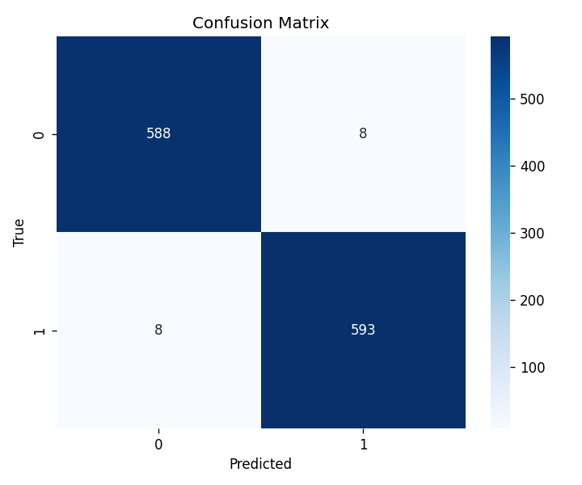

# Validation Report: UCI_Physical
*Generated 2026-04-10 15:17*

## Dataset Overview
- Subjects: 4
- Channels: 8
- Sampling rate: 1000 Hz
- Movements: 2

## Processing Parameters
- **sampling_rate**: 2000
- **bandpass**: [20, 450]
- **notch**: 50
- **window_size**: 400
- **overlap**: 0.5
- **normalize_signal**: True
- **compute_ar**: False
- **ar_order**: 6
- **compute_hjorth**: True
- **compute_inter_channel_corr**: True
- **compute_wavelet**: False
- **wavelet_name**: db4
- **wavelet_level**: 4
- **compute_freq_features**: False
- **compute_spectral_rolloff**: False
- **fft_pad_to_power_of_two**: True
- **compute_extra_stats**: True
- **compute_spectral_centroid**: False
- **use_sliding_window**: True
- **ssc_threshold**: 0.05
- **subsample_every_n**: 1
- **windowing_chunk_size**: 1024

## Feature Statistics (first 20 features, Mean +/- Std)
| Movement | ch0_IEMG | ch0_MAV | ch0_logMAV | ch0_MAVS | ch0_SSI | ch0_RMS | ch0_logRMS | ch0_VO3 | ch0_LogDet | ch0_WL | ch0_ZCR | ch0_SSC | ch0_logVAR | ch0_Skew | ch0_Kurt | ch0_TKEO | ch0_HjAct | ch0_HjMob | ch0_HjCmp | ch1_IEMG |
|---|---|---|---|---|---|---|---|---|---|---|---|---|---|---|---|---|---|---|---|---|
| 0 | 110.7874 +/- 145.2551 | 0.2770 +/- 0.3631 | -2.1857 +/- 1.5475 | -0.0003 +/- 0.2793 | 161.4763 +/- 393.9341 | 0.4131 +/- 0.4828 | -1.7984 +/- 1.6141 | 0.5334 +/- 0.5858 | 0.1434 +/- 0.2306 | 40.6229 +/- 46.0145 | 0.1293 +/- 0.0424 | 61.4501 +/- 47.1386 | -3.5947 +/- 3.2283 | 0.2259 +/- 0.7115 | 3.4716 +/- 4.6529 | 0.1339 +/- 0.3026 | 0.4046 +/- 0.9869 | 0.4528 +/- 0.1172 | 1.6323 +/- 0.3213 | 80.7958 +/- 149.5170 |
| 1 | 314.8664 +/- 193.3934 | 0.7872 +/- 0.4835 | -0.4649 +/- 0.7411 | -0.0008 +/- 0.6113 | 637.3349 +/- 644.2537 | 1.1130 +/- 0.5954 | -0.0799 +/- 0.6864 | 1.3811 +/- 0.6664 | 0.4240 +/- 0.3105 | 124.9629 +/- 84.0414 | 0.1173 +/- 0.0311 | 105.1171 +/- 23.1125 | -0.1575 +/- 1.3729 | 0.1264 +/- 0.5343 | 2.8377 +/- 4.0641 | 0.6274 +/- 0.7294 | 1.5969 +/- 1.6145 | 0.4479 +/- 0.0817 | 1.6076 +/- 0.2689 | 271.5730 +/- 186.8849 |

## Classification Results
- **Classifier**: see config
- **Cross-validation**: Leave-One-Subject-Out (LOSO)
- **PCA**: inside each fold (no data leakage)
- **Accuracy**: 98.66% +/- 0.53%

## Issues
None.